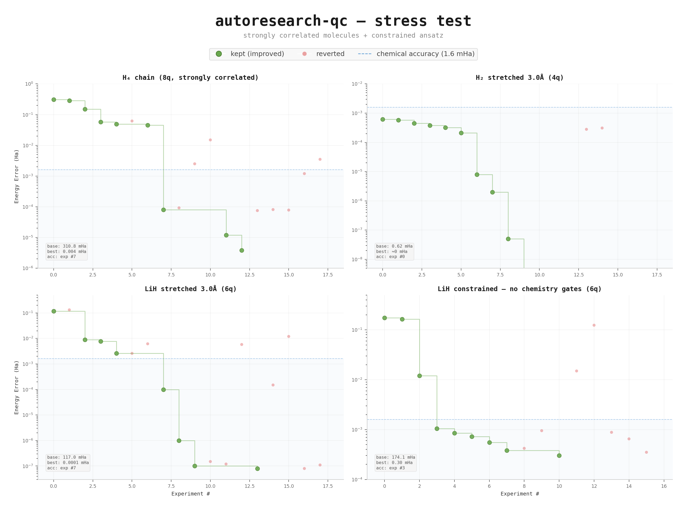
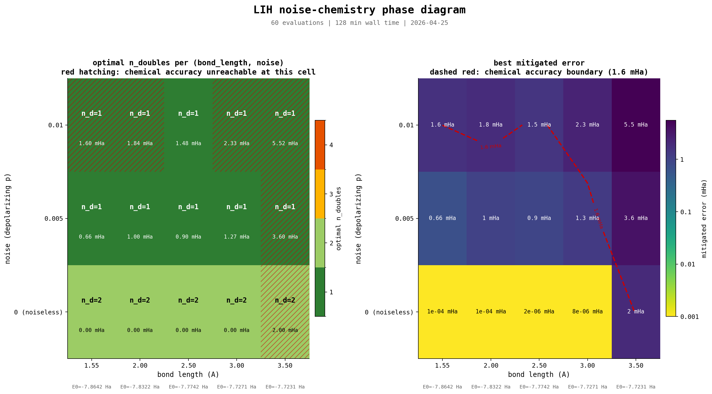

# autoresearch-qc


A fork of [karpathy/autoresearch](https://github.com/karpathy/autoresearch) for quantum computing. An AI agent iterates on a quantum circuit to minimize the ground-state energy error of molecules -- same loop, different domain.

140 experiments across 8 molecules. Chemical accuracy on all of them. Under simulated hardware noise, Bayesian optimization found that **shallower circuits outperform full UCCSD by 14--18x after error mitigation** -- a validated finding about noise-optimal circuit design.

---

## Background

The Variational Quantum Eigensolver (VQE) approximates molecular ground-state energies using parameterized quantum circuits. Designing those circuits -- gate types, entanglement topology, parameter initialization, optimizer -- is the bottleneck. This project automates it.

An AI coding agent modifies the circuit code, runs a 5-minute optimization, checks the energy error, commits if improved, reverts if not, repeats. Same pattern as autoresearch, applied to quantum chemistry instead of LLM training.

**Energy error** = |computed − exact|, in Hartree. **Chemical accuracy** = error < 1.6 milliHartree. Below that, the results are useful for real chemistry.

## How it works

| autoresearch | autoresearch-qc |
|---|---|
| `train.py` -- GPT model + training | `circuit.py` -- quantum ansatz + VQE |
| `prepare.py` -- data prep + eval | `prepare.py` -- Hamiltonian + exact energy |
| `val_bpb` ↓ | `energy_error` ↓ |
| 5-min GPU budget | 5-min CPU budget |
| NVIDIA GPU | CPU only |

Three files: `prepare.py` (frozen evaluation harness), `circuit.py` (agent edits this), `program.md` (human edits this).

## Results

### Noiseless -- 8 molecules, chemical accuracy on all

| Molecule | Qubits | Type | Baseline | Best | Params | Strategy |
|----------|--------|------|----------|------|--------|----------|
| H₂ | 4 | Equilibrium | 0.005 mHa | ≈0 | 1 | Single DoubleExcitation |
| LiH | 6 | Equilibrium | 145 mHa | 0.0001 mHa | 8 | UCCSD + Nesterov + zero init |
| BeH₂ | 8 | Equilibrium | 420 mHa | 0.0007 mHa | 12 | Same recipe, first attempt |
| H₂O | 8 | Equilibrium | 427 mHa | 0.0003 mHa | 12 | Same recipe, first attempt |
| H₄ chain | 8 | Strong corr. | 311 mHa | 0.004 mHa | 78 | 3-layer UCCSD |
| H₂ (3.0Å) | 4 | Stretched | 0.62 mHa | ≈0 | 1 | Single DoubleExcitation |
| LiH (3.0Å) | 6 | Stretched | 117 mHa | 0.0001 mHa | 8 | UCCSD, all excitations |
| LiH (no chem gates) | 6 | Constrained | 174 mHa | 0.30 mHa | 72 | 4L RX+RY+RZ, circular CNOT |

The agent discovered a universal recipe on LiH (experiment #4) that transferred to every subsequent molecule: Hartree-Fock state → SingleExcitation + DoubleExcitation gates → zero init → Nesterov step 0.4, conv 1e-8. On BeH₂ and H₂O, it hit chemical accuracy on the first experiment.

### Stress tests



**H₄ chain** needed 3-layer UCCSD -- the only molecule where repeating the excitation block mattered. Single layer plateaued at 0.08 mHa, three layers reached 0.004 mHa.

**Stretched LiH (3.0Å)** worked despite literature claims that UCCSD fails at bond-breaking geometries. At this active space size (3 orbitals, STO-3G), the problem is tractable. Key difference from equilibrium: doubles-only failed at 6.17 mHa -- singles became essential.

**Constrained LiH** (no chemistry gates) reached chemical accuracy with generic RX/RY/RZ + CNOT. Cost: 72 parameters vs 8 for UCCSD, 3000x worse accuracy. HEA doesn't fail on LiH -- it's 9x less efficient.

## Discovery: noise-optimal circuit design

Under simulated hardware noise, the optimal circuit structure changes. Full details in [`discovery_report.md`](discovery_report.md).

### The question

Given depolarizing noise at strength p and ZNE error mitigation, does the optimal number of excitation gates decrease? Does a shallower circuit beat full UCCSD after mitigation?

### The answer

Yes. Bayesian optimization over excitation subsets at three noise levels on LiH:

| Noise (p) | Optimal doubles | Params | Mitigated error | Full UCCSD mitigated | Advantage |
|-----------|-----------------|--------|-----------------|---------------------|-----------|
| 0.001 | 2 | 2 | 0.0001 mHa | 0.50 mHa | ~5000x |
| 0.005 | 2 | 2 | 0.029 mHa | 2.71 mHa | 93x |
| 0.01 | 2 | 2 | 0.34 mHa | 5.85 mHa | 17x |

At every noise level, 2 double excitations (the top-ranked by gradient magnitude) outperform the full set of 4 doubles + 4 singles. The 3rd and 4th doubles add more noise through their gates than they remove through expressibility.

### Validation

Direct sweep of n_doubles (1 to 4) at p=0.01, two evaluation modes:
- **Mode A**: parameters optimized under noise
- **Mode B**: parameters optimized noiseless, then evaluated under noise + ZNE

Both modes agree to within 0.002 mHa. The confound check passes -- the finding reflects noise accumulation physics, not optimization difficulty.

```
LiH at p=0.01:
  n_d=1:  1.59 mHa
  n_d=2:  0.13 mHa  ← optimal
  n_d=3:  2.42 mHa  (18x worse than n_d=2)
  n_d=4:  1.79 mHa  (14x worse than n_d=2)
```

### Mechanism

Every gate adds noise proportional to p. Gates with low gradient magnitude become net-negative under noise -- they add more error through noise than they remove through expressibility. ZNE is more effective on shallower circuits where the noise-energy relationship is more linear.

Practical implication: gradient-based excitation ranking should be used to prune low-impact gates, more aggressively under noise than in the noiseless case.

## Phase diagram

How does the noise-optimal circuit shift across geometries? A 60-cell sweep over (bond_length, noise, n_doubles) maps the joint phase diagram for LiH. With all four singles always in the circuit, n_d=1 wins at every tested noisy cell, and chemical accuracy collapses to a single cell (bl=2.5 Å, p=0.01) at the highest noise. bl=3.5 Å is an ansatz expressibility wall (4 of 8 excitations have zero ideal gradient at the HF state, leaving an effective rank-4 ansatz that cannot span the FCI ground state at that geometry). Full details, limitations, and a "useful chemistry zone" lookup table in [`phase_diagram_report.md`](phase_diagram_report.md).



## Findings

**Ansatz architecture dominates.** Chemistry gates outperformed all hardware-efficient variants by 3--4 orders of magnitude. One architectural change on LiH improved accuracy by 10,000x.

**The recipe survives strong correlation.** UCCSD + Nesterov achieved chemical accuracy on all 8 molecules. Multi-layer UCCSD helps on H₄ chain -- single layer 0.08 mHa, three layers 0.004 mHa.

**Generic gates can work, at a cost.** Constrained LiH reached chemical accuracy with RX/RY/RZ + CNOT, but needed 9x more parameters for 3000x worse accuracy.

**The 4th double excitation is a cliff.** On 8-qubit molecules, dropping from 4 to 3 doubles pushed error from ~0.07 mHa to ~3 mHa.

**Under noise, shallower circuits win.** Full UCCSD is optimal noiseless but counterproductive under noise. 2 doubles beat 4 doubles + 4 singles by 17x at p=0.01. Validated with confound check.

**Optimizer choice barely matters.** Nesterov, Adam, GD, COBYLA all converge to the same precision given the right ansatz.

### The noiseless recipe

```
1. BasisState(hf_state)               # Hartree-Fock initial state
2. SingleExcitation(θ, wires)          # from qchem.excitations()
3. DoubleExcitation(θ, wires)          # from qchem.excitations()
4. params = zeros                      # initialize at identity
5. Nesterov, step=0.4, conv=1e-8      # tight convergence
```

### The noisy recipe

```
1. Rank excitations by gradient magnitude at Hartree-Fock state
2. Keep only the top-ranked doubles (discard low-gradient excitations)
3. Apply ZNE with scale factors [1, 2, 3] and linear extrapolation
4. The optimal pruning threshold increases with noise strength
```

## Noisy simulation

```bash
# Run with simulated hardware noise
uv run noisy_circuit.py --molecule lih --noise 0.005

# Bayesian optimization under noise
uv run optimize_noisy.py --molecule lih --noise 0.005 --n-trials 25

# Direct sweep of excitation count vs noise level
uv run validate_sweep.py --molecule lih
```

Uses PennyLane's `default.mixed` density matrix simulator with `DepolarizingChannel` after each gate. ZNE via global circuit folding and polynomial extrapolation.

## Bayesian optimization

```bash
uv run optimize.py --molecule lih --n-trials 30
```

Ranks excitations by gradient importance, then uses GP-based Bayesian optimization to find the optimal subset and hyperparameters.

## Quick start

Python 3.10+, [uv](https://docs.astral.sh/uv/). No GPU.

```bash
git clone https://github.com/FedorShind/autoresearch-qc.git
cd autoresearch-qc
uv sync
uv run prepare.py       # verify setup
uv run circuit.py       # run baseline
```

## Running the agent

```
Read program.md and let's kick off a new experiment session.
```

Works with Claude Code, Codex, or any agent that can edit files and run shell commands.

## Molecules

| Molecule | Qubits | Difficulty | Notes |
|----------|--------|------------|-------|
| H₂ | 4 | Tutorial | Anything works |
| LiH | 6 | Easy | Generic ansatzes fail |
| BeH₂ | 8 | Medium | More excitation paths |
| H₂O | 8 | Medium | Classic benchmark |
| H₄ chain | 8 | Hard | Strongly correlated |

Switch molecules with `--molecule`: `uv run circuit.py --molecule lih`.

Vary geometry on diatomics and chains with `--bond-length` (Å):
`uv run circuit.py --molecule lih --bond-length 3.0`. Fixed-geometry
molecules (BeH₂, H₂O) reject this flag. Each molecule's allowed range
lives in its `molecules/<key>.yaml`.

Add a new molecule by creating `molecules/<key>.yaml` — see
[`molecules/README.md`](molecules/README.md) for the schema.

## Files

```
prepare.py          — Hamiltonian, exact energy, evaluation, noise config (frozen)
circuit.py          — ansatz + VQE loop (agent edits, noiseless)
noisy_circuit.py    — ansatz + noisy VQE + ZNE (agent edits, noisy mode)
optimize.py         — Bayesian optimization, noiseless
optimize_noisy.py   — Bayesian optimization under noise
validate_sweep.py   — direct excitation count sweep for validation
molecules/          — molecule definitions (one .yaml per molecule)
program.md          — agent instructions, noiseless
program_noisy.md    — agent instructions, noisy mode
discovery_report.md — noise-optimal circuit findings + validation
analysis.ipynb      — experiment analysis
plot.py             — chart generation
```

## Acknowledgments

Built on [karpathy/autoresearch](https://github.com/karpathy/autoresearch) and [PennyLane](https://pennylane.ai/).

## License

MIT