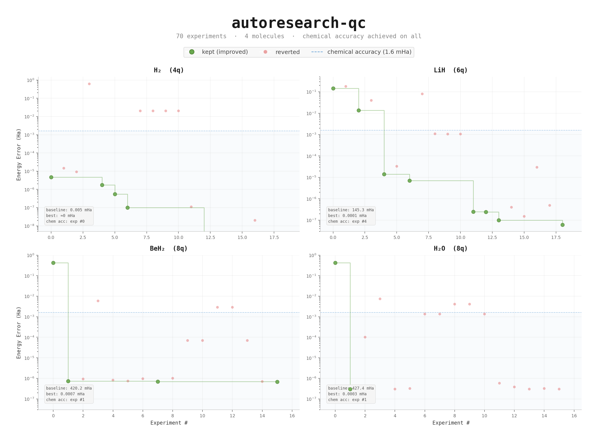
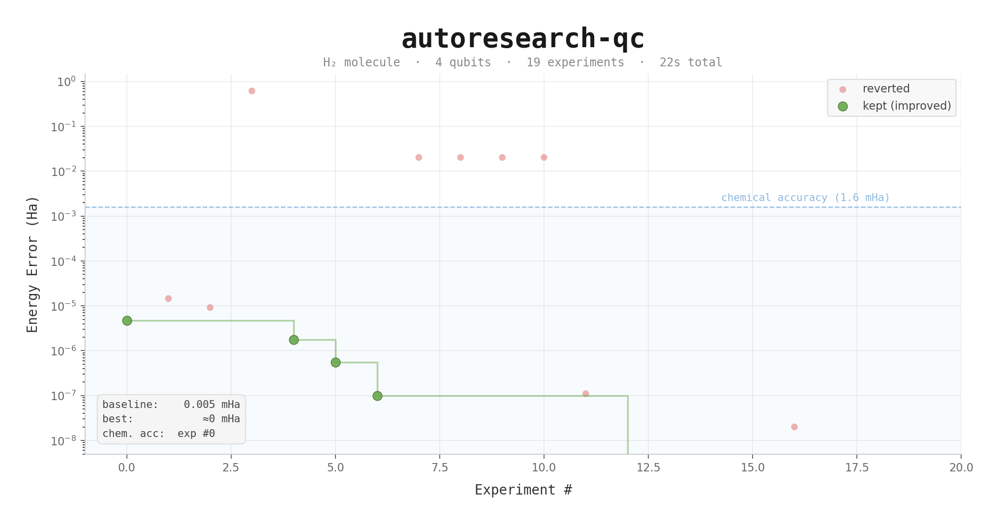
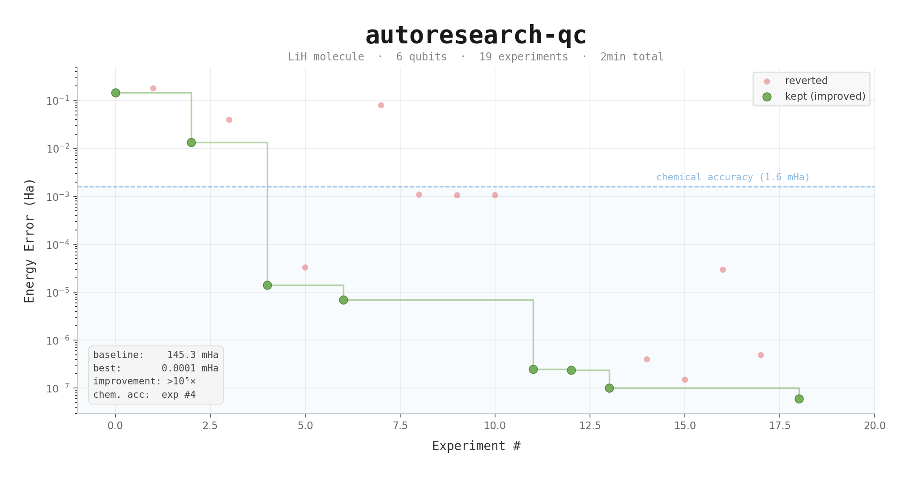
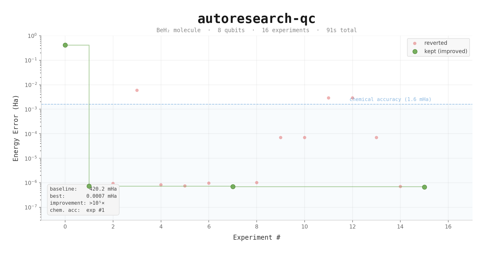
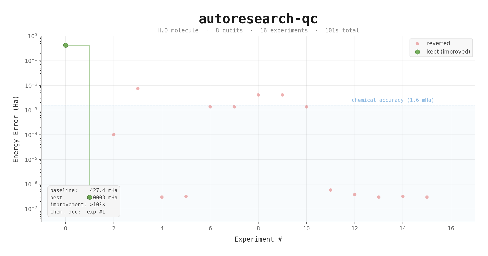

# autoresearch-qc



A fork of [karpathy/autoresearch](https://github.com/karpathy/autoresearch) for quantum computing. Instead of optimizing an LLM training script, an AI agent iterates on a variational quantum circuit to minimize the ground-state energy error of molecules.

It ran 70 experiments across four molecules (H₂, LiH, BeH₂, H₂O) and achieved chemical accuracy on all of them.

---

## Background

The Variational Quantum Eigensolver (VQE) approximates the ground-state energy of a molecule using a parameterized quantum circuit. The hard part is designing that circuit -- choosing gate types, entanglement patterns, parameter initialization, optimizer settings.

This is normally done by hand.

This project hands that job to an AI coding agent. The agent modifies the circuit code, runs a 5-minute optimization, checks whether the energy error went down, commits or reverts, and repeats. Same loop as autoresearch, different domain.

**Energy error** = |computed energy − exact energy|, in Hartree. **Chemical accuracy** = energy error < 1.6 milliHartree (mHa). Below this threshold, the results are useful for real chemistry.

## Structure

Same three-file pattern as the original:

- **`prepare.py`** -- Hamiltonian construction, exact energy via diagonalization, evaluation, timer. Agent does not modify.
- **`circuit.py`** -- Ansatz definition, optimizer config, VQE loop. **Agent modifies this.**
- **`program.md`** -- Agent instructions with quantum-specific constraints. **Human modifies this.**

| autoresearch | autoresearch-qc |
|---|---|
| `train.py` -- GPT model + training loop | `circuit.py` -- quantum ansatz + VQE loop |
| `prepare.py` -- data prep + eval | `prepare.py` -- Hamiltonian + exact energy |
| `val_bpb` (lower is better) | `energy_error` (lower is better) |
| 5-min GPU training budget | 5-min CPU optimization budget |
| single NVIDIA GPU | single CPU core (no GPU needed) |

## Results

Four molecules, 15--20 experiments each, fully autonomous.

### H₂ -- hydrogen (4 qubits)



Trivial. The baseline hardware-efficient ansatz (RY + CNOT) already hit chemical accuracy at 0.005 mHa. The agent reduced it further to machine precision using a single `DoubleExcitation` gate -- **1 parameter**, 0.2 seconds. H₂ doesn't test anything meaningful, but it validates the loop.

### LiH -- lithium hydride (6 qubits)



The baseline HEA started at 145 mHa -- 90x above chemical accuracy. Optimizer tuning, different entanglement patterns, initialization tricks -- none of it helped. On experiment #4 the agent switched to chemistry-inspired gates (`SingleExcitation` + `DoubleExcitation` from `qml.qchem.excitations`). Error dropped to 0.014 mHa. That's a 10,000x improvement from one architectural change. Further tuning brought it to 0.0001 mHa.

### BeH₂ -- beryllium hydride (8 qubits)



First 8-qubit molecule. The agent applied what it learned on LiH (UCCSD gates + Nesterov momentum) and hit chemical accuracy on experiment #1 -- from 420 mHa to 0.0007 mHa. The remaining experiments tested how far parameters could be reduced: 12 (8 singles + 4 doubles) is the minimum. Dropping below 4 doubles breaks chemical accuracy for both 8-qubit molecules.

### H₂O -- water (8 qubits)



Baseline: 427 mHa. After the recipe: 0.0003 mHa. Oxygen's lone pairs didn't make a difference at this active-space size -- H₂O and BeH₂ behaved identically. Same minimum parameter count (12), same threshold behavior.

### Summary

| Molecule | Qubits | Baseline Error | Best Error | Min Params | Chem. Acc. at |
|----------|--------|---------------|------------|------------|---------------|
| H₂ | 4 | 0.005 mHa | ≈0 mHa | 1 | exp #0 |
| LiH | 6 | 145.3 mHa | 0.0001 mHa | 8 | exp #4 |
| BeH₂ | 8 | 420.2 mHa | 0.0007 mHa | 12 | exp #1 |
| H₂O | 8 | 427.4 mHa | 0.0003 mHa | 12 | exp #1 |

## Findings

**1. Ansatz architecture dominates everything else.** Chemistry gates (`SingleExcitation`, `DoubleExcitation`) outperformed all hardware-efficient variants by 3--4 orders of magnitude on LiH. These gates encode particle-number conservation and orbital excitation structure. The optimizer doesn't need to rediscover physics that's already baked into the gate set.

**2. Easy molecules hide bad circuits.** H₂ gave chemical accuracy with a generic RY+CNOT ansatz. LiH did not -- the same ansatz missed by 90x. Testing only on simple problems gives a false sense of correctness.

**3. Fewer parameters, better results.** Best H₂ circuit: 1 parameter. Best LiH: 8. Best 8-qubit circuits: 26 full UCCSD, but 12 suffice for chemical accuracy. Chemistry gates operate in the relevant subspace -- fewer degrees of freedom, smoother landscape.

**4. Sharp threshold at the 4th double excitation.** On both BeH₂ and H₂O, reducing from 4 to 3 double excitations pushes error from ~0.07 mHa to ~3--4 mHa. Not a gradual degradation -- a cliff.

**5. Optimizer choice barely matters.** Nesterov, Adam, GD, COBYLA all converge to the same precision given the right ansatz. Speed differs (Nesterov/GD are 2--3x faster than Adam), accuracy does not.

### The recipe that worked on everything

```
1. BasisState(hf_state)               # Hartree-Fock initial state
2. SingleExcitation(θ, wires)          # from qchem.excitations()
3. DoubleExcitation(θ, wires)          # from qchem.excitations()
4. params = zeros                      # initialize at identity
5. Nesterov, step=0.4, conv=1e-8      # tight convergence
```

No modification needed across molecules. H₂ (1 param) through H₂O (26 params).

## Quick start

Python 3.10+, [uv](https://docs.astral.sh/uv/). No GPU.

```bash
git clone https://github.com/FedorShind/autoresearch-qc.git
cd autoresearch-qc
uv sync

# verify
uv run prepare.py

# run baseline
uv run circuit.py
```

## Running the agent

```
Read program.md and let's kick off a new experiment session.
```

Works with Claude Code, Codex, or any coding agent that can edit files and run shell commands. The agent creates a branch, runs the baseline, then iterates. ~12 experiments/hour on H₂, slower on larger molecules.

## Molecules

| Molecule | Qubits | Electrons | Difficulty | Notes |
|----------|--------|-----------|------------|-------|
| H₂ | 4 | 2 | Tutorial | Almost anything works |
| LiH | 6 | 2 | Easy | Generic ansatzes fail here |
| BeH₂ | 8 | 4 | Medium | More excitation paths |
| H₂O | 8 | 4 | Medium | Classic benchmark |
| H₄ chain | 8 | 4 | Hard | Strongly correlated, multi-reference |

Change `MOLECULE` in `prepare.py` to switch.

## Design choices

- **Single file to modify.** Agent only touches `circuit.py`. Diffs are reviewable.
- **Fixed time budget.** 5 minutes per experiment. Small molecules finish in seconds; the budget matters at 8+ qubits.
- **Real metric.** Chemical accuracy (1.6 mHa) is a standard from computational chemistry, not an arbitrary number.
- **CPU-only.** ≤10 qubit simulation is fast on CPU. Runs on a laptop.
- **Physics-informed instructions.** `program.md` includes barren plateau awareness, HF state priors, and gate recommendations that generic agents lack.

## Files

```
prepare.py      — molecule setup, exact energy, evaluation (do not modify)
circuit.py      — ansatz, optimizer, VQE loop (agent modifies this)
program.md      — agent instructions (human modifies this)
analysis.ipynb  — experiment analysis notebook
plot.py         — generate progress charts from results.tsv
pyproject.toml  — dependencies
```

## Acknowledgments

Built on [karpathy/autoresearch](https://github.com/karpathy/autoresearch) and [PennyLane](https://pennylane.ai/) by Xanadu.

## License

MIT
