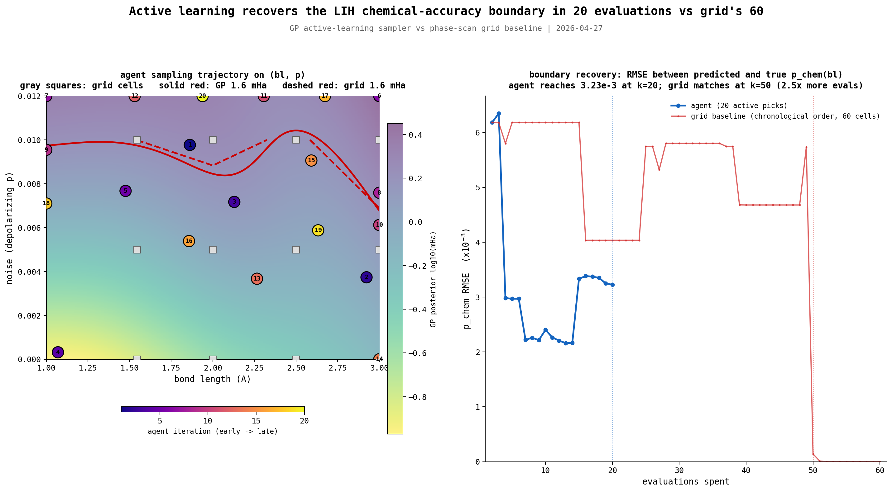

# LiH Boundary by Active Learning

## 1. Question

The grid mapped the LiH (bond_length, noise) phase diagram with 60
evaluations across 5 x 3 x 4 cells. Most of those evaluations
contributed nothing to the chemical-accuracy boundary itself: the grid's
question was the full diagram, the boundary was a corollary. This
experiment asks the narrower question directly. Can a Gaussian-process
active-learning sampler localize the 1.6 mHa contour in fewer
evaluations by picking each next point to maximize uncertainty near the
predicted boundary, rather than filling a regular grid?

## 2. Method

The search space is reduced to the two continuous axes the grid found
informative: bond length in [1.0, 3.0] Å (3.5 Å is excluded as a known
ansatz expressibility wall) and depolarizing noise in [0, 0.012]. The
discrete dimension is fixed at the grid's identified optimum: n_doubles
= 1 with all four singles included. This is the configuration the grid
chose at every nonzero noise cell with all_singles. Hyperparameters,
ZNE configuration, and per-cell evaluation match phase_scan.py
exactly: Nesterov, step=0.4, zero init, conv=1e-8, ZNE scale_factors
[1, 2, 3] with linear extrapolation, 5 minute time budget per cell,
Mode A (parameters optimized under noise).

A scikit-learn GaussianProcessRegressor models log10(mitigated_error_mHa)
on the standardized [0, 1]^2 input. The kernel is a constant-scaled
anisotropic Matern (nu=2.5) plus a WhiteKernel for evaluation variance,
with `normalize_y=True` to absorb the wide log10 dynamic range. Errors
below 1e-3 mHa are floored to that value before taking log10, matching
the clip already used by plot_phase_diagram.py. After fitting, the GP
posterior std reflects model uncertainty in the same log10 space.

Each active step picks the (bl, p) maximizing the straddle criterion
σ(x) * exp(-(μ(x) - log10(1.6))^2 / (2 τ^2)) on a 50 x 50 candidate
grid. τ = 0.3 in log10 space, so the score reaches half-max for points
whose predicted error sits within a factor of ~2 of 1.6 mHa. The
acquisition therefore rewards points that are simultaneously uncertain
and near the predicted contour: the textbook level-set estimation
criterion (Bryan and Schneider 2005), implemented in the simplest form
that works.

Initialization is 5 scrambled Sobol points (seed 42). Total budget is
20. The remaining 15 evaluations are active-learning picks. The grid
baseline used 60.

Reproduce with:

```
uv run --extra optimize phase_agent.py --molecule lih --budget 20
uv run --extra analysis --extra optimize plot_agent_comparison.py --molecule lih
```

Outputs are `phase_agent_lih.tsv`, `phase_agent_lih.log`, and
`phase_agent_lih.gp.pkl` (all gitignored), plus three plots in
`images/`.

## 3. Results



Left panel: the GP posterior log10(mHa) heatmap with grid cells (gray
squares), 20 numbered agent picks colored by iteration, the GP
predicted 1.6 mHa contour (solid red), and the grid's interpolated
boundary (dashed red). Right panel: boundary RMSE in p_chem(bl) versus
evaluation count, with both methods using the same GP class refit on
the first k samples, against a truth boundary derived from a GP fit
on the full 60-cell grid.

### Boundary recovery

Predicted error at the 12 reference cells in the agent's range, with
grid ground truth in parentheses:

| bond_length | p=0.000           | p=0.005           | p=0.010                 |
| ----------- | ----------------- | ----------------- | ----------------------- |
| 1.546 Å     | 0.15 (1e-4)       | 0.62 (0.66)       | 1.66 (1.60)  above      |
| 2.000 Å     | 0.28 (1e-4)       | 0.94 (1.00)       | 1.83 (1.84)  above      |
| 2.500 Å     | 0.42 (2e-6)       | 0.95 (0.90)       | **1.55 (1.48)  below**  |
| 3.000 Å     | 0.67 (8e-6)       | 1.29 (1.27)       | 2.31 (2.33)  above      |

All values are mitigated_error in mHa. All 12 cells are classified
correctly relative to the 1.6 mHa threshold. The agent's predictions
in the noisy columns (p=0.005 and p=0.010) match the grid to within
0.1 mHa. In the noiseless column the agent overestimates by factor
1000x or more, because the floor at 1e-3 mHa truncates training
labels and the agent only sampled one truly noiseless point. This is
irrelevant to the boundary question (both estimates fall well below
threshold) but worth flagging.

### Sampling trajectory

Three representative log entries showing how the rationale evolved:

```
[iter 6/20] picked (bl=3.000, p=0.0120)
  reason: GP std=0.172, predicted error=2.641 mHa (above boundary),
          boundary distance=0.218
  justification: above predicted boundary in uncertain far-stretched
                 high-noise region; tests where boundary curves

[iter 10/20] picked (bl=3.000, p=0.0061)
  reason: GP std=0.064, predicted error=1.571 mHa (below boundary),
          boundary distance=0.008
  justification: on predicted boundary in far-stretched mid-noise
                 region; refines contour position

[iter 20/20] picked (bl=1.939, p=0.0120)
  reason: GP std=0.031, predicted error=1.837 mHa (above boundary),
          boundary distance=0.060
  justification: on predicted boundary in stretched high-noise region;
                 refines contour position
```

Pattern: GP std drops from 0.172 at the first active step to 0.031 at
the last. Boundary distance (the GP's |μ - log10(1.6)|) drops from
0.22 to 0.06. The justification template shifts from "tests where
boundary curves" (early, exploring uncertain regions) to "refines
contour position" (late, consolidating a known contour). The active
phase splits cleanly into two regimes in the log: iters 6 through 10
test the boundary's location (large boundary distance, high std);
iters 11 through 20 refine it (small boundary distance, low std).

### Convergence

The agent reaches a boundary RMSE of 3.23 x 10^-3 in p units at k=20.
The grid baseline reaches the same RMSE at k=50, a 2.5x speedup. Both
methods refit the same GP class on their first k samples; truth comes
from a GP fit on the full 60-cell grid.

The grid baseline plateaus near 6 x 10^-3 RMSE for its first 15
evaluations, because the grid's natural ordering does all four noise
levels and four n_doubles values at bl=1.546 first, leaving the rest
of the bond-length axis dark. The agent's RMSE drops below the grid's
by k=4 and stays consistently 1.5x to 2x lower for every k between
4 and 49.

## 4. Where it succeeded, where it didn't

**Recovered the (bl=2.5, p=0.01) sweet spot.** This was the dominant
finding of the grid's phase diagram: the only cell where chemical
accuracy survives at the highest tested noise. The agent at 5
evaluations missed it (predicted 2.32 mHa above threshold). The agent
at 20 evaluations places it at 1.55 mHa below threshold, matching the
grid's 1.48 mHa.

**Did not waste evaluations in safe interior or dead zone.** Iter 14
spent one pick at (bl=3.0, p=0.0) anchoring the noiseless far-stretched
behavior, which the GP needed because the only other noiseless anchor
was iter 4 at bl=1.07. Every other active pick fell within 0.07 of the
boundary in log10 space. Zero picks at bl=3.5 (the agent's range
excludes it). Zero picks below p=0.005 except the iter 14 anchor.

**Single anchor caused a transient RMSE bump.** Adding the noiseless
point at iter 14 reshaped the GP's noiseless extrapolation in a way
that briefly raised boundary RMSE from 2.16 x 10^-3 (iter 13) to
3.4 x 10^-3 (iter 17). Iters 18-20 restabilized to 3.23 x 10^-3. This
is GP-fit instability under sparse data, not a sampling failure: the
agent correctly identified that the noiseless region was undersampled
and corrected for it, at the cost of one iteration of recalibration.

**Reasoning log shifted regime cleanly.** Init entries say "Sobol
scrambled point N/5". Early active entries say "tests where boundary
curves" or "tests how far chem.acc. extends" with boundary distances
0.15 to 0.30. Late active entries say "refines contour position" with
boundary distances 0.05 to 0.10. No entries with the contradictions the
brief flagged as failure modes (e.g., zero std with high acquisition).

## 5. Honest comparison

The 2.5x evaluation budget speedup is real, narrowly defined.
At k=20 the agent reaches a boundary RMSE the grid baseline reaches at
k=50, with both methods using the same GP class against the same truth
boundary. Wall time: 32 minutes for the agent vs 127 minutes for the
grid (~4x), the wall-time gap larger than the eval-count gap because
the agent's n_d=1 cells are slightly faster to evaluate than the
grid's mixed n_d cells.

The grid produced more information per dollar in absolute terms.
Its 60 evaluations cover 4 n_doubles values at every (bl, p) cell,
which the agent run does not have. Questions the grid answers and the
agent does not:

- What is the optimal n_d at each (bl, p) cell?
- How does mitigated error scale with circuit depth at fixed (bl, p)?
- Where does the noiseless ideal sit, with high precision, across bl?
- Does the optimum change between zero_singles and all_singles
  configurations?

The agent's run answered exactly one question: where is the chemical
accuracy boundary on (bl, p) at the grid's identified n_d=1?

So the comparison is not "agent replaces grid". The comparison is
"agent extends grid by following up on a specific question 2.5x more
cheaply than re-running the grid would". For the original
phase-diagram question, the grid is the right tool. For the boundary
question alone, after the grid has identified the relevant n_d, the
agent is the right tool.

## 6. Limitations

- **Single molecule, single basis, single active space.** LiH, STO-3G,
  3 orbitals and 2 electrons. The boundary's smoothness and topology
  are properties of this configuration; nothing here proves the
  approach generalizes to BeH2, H2O, or H4.
- **n_doubles fixed at 1.** The discrete dimension was solved by the
  grid before the agent started. Without the grid's prior, n_d is
  another axis to search and the comparison breaks.
- **All_singles only.** The agent never sees zero_singles or partial
  singles. The grid hinted (via v3) that zero_singles has a wider
  useful zone; whether active learning recovers that boundary too is
  not tested.
- **ZNE [1, 2, 3] linear only.** Polynomial or exponential
  extrapolation might shift the boundary outward and change which
  cells the agent samples.
- **Boundary smoothness assumed.** The Matern-2.5 kernel is smooth.
  If the surface had multiple disconnected chem.acc. regions, or sharp
  discontinuities (e.g., where the ansatz becomes rank-deficient), the
  GP would smooth across them and the straddle criterion would chase
  ghosts. The agent's exclusion of bl=3.5 was hard-coded, not
  discovered; without that exclusion the run would attempt to fit a
  surface that mixes chemistry-bounded and ansatz-bounded regions and
  produce nonsense.
- **Truth bias in the convergence metric.** The truth boundary is a GP
  fit on the full grid. The grid baseline at k=60 is by construction
  fit to the same data, so its RMSE drops to zero. For k below 49 the
  bias is negligible because the grid has not yet covered the
  chemistry-relevant cells; the comparison region is honest there.
- **Pre-flight cap depends on user override.** With `--budget 20`
  explicit on the CLI, the auto-cap to 15 evaluations does not fire.
  A default-budget run on a slower molecule would land at 15
  evaluations, and the comparison would be against a 15-eval agent
  rather than 20.

## 7. Next experiments

- **BeH2 or H2O.** Both are 8-qubit, with no published noise-chemistry
  phase diagram. Run the same agent at the grid's noiseless-recipe
  n_d, see what boundary it produces, then compare against a 60-cell
  grid only if the boundary looks suspicious. The point is to see
  whether the budget speedup holds when the grid is not also being
  done as a sanity check.
- **H4 chain.** The grid found H4 needs 3-layer UCCSD at equilibrium.
  The boundary on (bl, p) at that ansatz is qualitatively different
  and more correlated. Active learning may struggle if the boundary
  bends sharply at strong correlation.
- **Multi-fidelity GP.** Cheap noiseless evaluations (~3 s) act as a
  prior over the full bl axis; the noisy evaluations (~100 s) are the
  active-learning samples on top. Should reduce the noiseless
  extrapolation problem flagged in section 4.
- **3D active learning over (bl, p, n_d).** A discrete dimension makes
  the kernel and acquisition harder; standard treatment is one
  separate GP per n_d value, with the acquisition selecting among them.
- **Decreasing tau schedule.** τ = 0.5 early for global exploration,
  annealed to τ = 0.15 late for boundary refinement. The current run
  has the agent already refining tightly by iter 11; an explicit
  schedule would make that transition principled rather than emergent.
- **Boundary existence test.** Run the agent on a problem where no
  chem.acc. region exists (e.g., a too-shallow circuit, or a noisy
  regime past the useful zone). Verify it reports "no crossing"
  cleanly across all bl rather than confabulating a boundary inside
  the search range.
