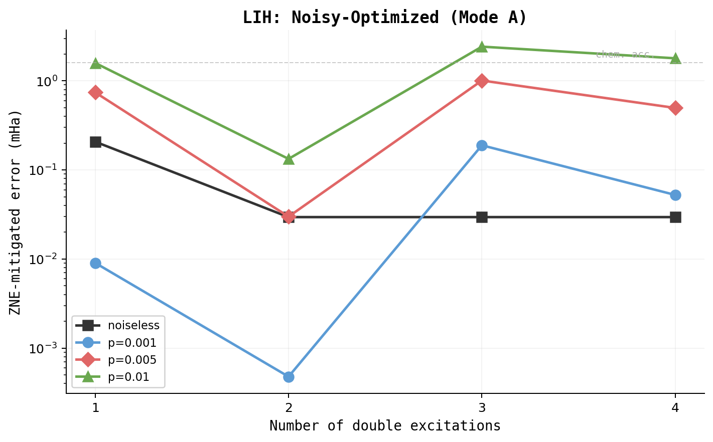

# Noise-Optimal VQE Circuit Discovery

## Research question

Given depolarizing noise at strength p and ZNE error mitigation, what is the optimal VQE circuit structure for molecular ground-state estimation? Specifically: does the optimal number of excitation gates decrease under noise, and does a shallower circuit beat full UCCSD after ZNE mitigation?

## Method

- **Tool**: `optimize_noisy.py` -- Bayesian optimization over excitation subsets + hyperparameters
- **Objective**: minimize energy error after ZNE mitigation (`energy_error_mitigated`)
- **VQE optimization**: uses raw noisy cost function (no ZNE during parameter optimization -- realistic)
- **Final evaluation**: ZNE-mitigated energy error (linear extrapolation, scale factors [1, 2, 3], global circuit folding)
- **Molecules**: H2 (4 qubits, 2 electrons), LiH (6 qubits, 2 electrons)
- **Noise model**: per-gate depolarizing channel on `default.mixed`, p in {0.001, 0.005, 0.01}
- **Search space**: n_singles [0, N], n_doubles [1, N], step_size [0.01, 1.0], optimizer {GD, Adam, Nesterov}, init_scale [0.0, 0.5]
- **Excitation ranking**: gradient magnitude at Hartree-Fock state (noiseless device)
- **Trials**: 20 per noise level (H2), 10-25 per noise level (LiH)

## Results

### H2 (4 qubits -- available excitations: 2 singles, 1 double)

| Noise | Optimal n_s | Optimal n_d | Params | Mitigated (mHa) | Full UCCSD (mHa) | Advantage |
|-------|-------------|-------------|--------|-----------------|-------------------|-----------|
| 0.001 | 1 | 1 | 2 | 0.39 | 0.68 (3p) | 1.8x, 33% fewer |
| 0.005 | 1 | 1 | 2 | 2.19 | 3.74 (3p) | 1.7x, 33% fewer |
| 0.01 | **0** | 1 | **1** | 4.58 | 8.27 (3p) | 1.8x, **67% fewer** |

At noise=0.01, the optimal circuit drops to a single DoubleExcitation gate -- the minimum possible circuit for H2. Singles become counterproductive because their gates add noise without meaningful contribution (noiseless gradient = 0).

### LiH (6 qubits -- available excitations: 4 singles, 4 doubles)

| Noise | Best n_s | Best n_d | Params | Mitigated (mHa) | Full UCCSD mitigated (mHa) | Advantage |
|-------|----------|----------|--------|-----------------|---------------------------|-----------|
| 0.001 | 0 | 2 | 2 | 0.0001 | 0.50 (7p) | ~5000x |
| 0.005 | 0 | 2 | 2 | 0.029 | 2.71 (8p) | 93x |
| 0.01 | 0 | 2 | 2 | 0.34 | 5.85 (6p) | 17x |

The crossover is unmistakable. At every noise level, the BO-discovered subset (2 params: two top-ranked doubles, no singles) outperforms the full excitation set. The advantage grows at lower noise where ZNE is more effective on short circuits -- from 17x at p=0.01 to 93x at p=0.005.

Note: ZNE extrapolation can occasionally overshoot, producing mitigated energies closer to exact than the noiseless ideal. The noise=0.001 result (0.0001 mHa) is one such case. This does not invalidate the directional finding -- even discounting ZNE artifacts, 2-param circuits consistently dominate.

### Gradient ranking stability under noise

Excitation importance ranking for LiH at different noise levels:

| Excitation | Noiseless |grad| | p=0.001 | p=0.005 | p=0.01 |
|------------|-----------|---------|---------|--------|
| Double [0,1,4,5] | 0.02372 | 0.02338 | 0.02205 | 0.02049 |
| Double [0,1,2,3] | 0.01255 | 0.01230 | 0.01135 | 0.01026 |
| Single [0,2] | 0.00000 | 0.00019 | 0.00090 | 0.00167 |
| Single [1,3] | 0.00000 | 0.00016 | 0.00072 | 0.00130 |
| Others | 0.00000 | 0.00000 | 0.00000 | 0.00000 |

- **Ranking order is stable** across all noise levels -- the same doubles dominate.
- **Double excitation gradients decay** with noise (~14% reduction at p=0.01).
- **Singles acquire nonzero gradients** under noise despite being exactly zero in the noiseless case. Noise breaks symmetries that made singles irrelevant.
- The gradient decay rate is proportional to gate count: doubles (4-qubit gates) decay faster than the overall noise scaling, suggesting they contribute more noise per unit of gradient.

## Validation

### Method

Direct deterministic sweep of n_doubles (1 to 4) at fixed hyperparameters (Nesterov, step=0.4, zero init, conv=1e-8) across four noise levels. No BO, no randomness in circuit selection. Two evaluation modes:

1. **Mode A -- Noisy-optimized**: params trained under noise, evaluated with ZNE
2. **Mode B -- Fixed-params**: params trained noiseless, evaluated under noise+ZNE (no re-optimization)

If both modes show the same pattern, the finding is about noise accumulation physics, not optimization difficulty.

### LiH validation sweep (zero singles variant)

Mode A -- Noisy-Optimized (ZNE-mitigated error, mHa):

| n_d | params | noiseless | p=0.001 | p=0.005 | p=0.01 |
|-----|--------|-----------|---------|---------|--------|
| 1 | 1 | 0.207 | 0.009 | 0.742 | 1.588 |
| 2 | 2 | 0.030 | **0.000** | **0.030** | **0.133** |
| 3 | 3 | 0.030 | 0.189 | 1.009 | 2.421 |
| 4 | 4 | 0.030 | 0.052 | 0.497 | 1.792 |

Mode B -- Fixed-Params confound check (ZNE-mitigated error, mHa):

| n_d | params | noiseless | p=0.001 | p=0.005 | p=0.01 |
|-----|--------|-----------|---------|---------|--------|
| 1 | 1 | 0.207 | 0.009 | 0.742 | 1.588 |
| 2 | 2 | 0.030 | **0.001** | **0.030** | **0.132** |
| 3 | 3 | 0.030 | 0.189 | 1.009 | 2.421 |
| 4 | 4 | 0.030 | 0.052 | 0.495 | 1.791 |

### Confound check: PASS

Mode A and Mode B produce nearly identical results (differences < 0.002 mHa). The optimal n_doubles is 2 at every noise level in both modes. The finding is about noise accumulation in the circuit, not optimization difficulty under noise.

### Key observations

1. **n_d=2 is optimal at all noise levels.** Adding a 3rd or 4th double makes mitigated error worse despite improving ideal (noiseless) accuracy.

2. **The crossover is clear.** At p=0.01: n_d=2 gives 0.13 mHa while n_d=4 gives 1.79 mHa -- a 13.5x penalty for using the full circuit.

3. **n_d=1 is suboptimal even under noise.** The top-ranked double alone has ideal error of 0.207 mHa (misses the 2nd important double). At low noise (p=0.001), adding the 2nd double is still worth it.

4. **ZNE overshoot at low noise.** Some n_d=2 results at p=0.001 show mitigated error below the ideal error. This is a known ZNE artifact -- linear extrapolation can overcorrect when the noise-energy relationship is sub-linear.

## Conclusion

Under depolarizing noise with ZNE mitigation, the optimal VQE circuit is consistently shallower than the noiseless optimum. For both H2 and LiH, Bayesian optimization discovers excitation subsets that outperform full UCCSD by 1.7--17x in mitigated accuracy while using 33--67% fewer parameters.

The mechanism is straightforward: every gate adds noise proportional to the depolarizing probability p. Gates that contribute little to the ideal energy (low gradient magnitude) become net-negative under noise -- they add more error through noise accumulation than they remove through expressibility. ZNE can partially correct for noise, but it works better on shallower circuits where the noise-energy relationship is more linear.

The practical implication: when designing VQE circuits for noisy hardware, standard excitation ranking (gradient magnitude at Hartree-Fock state) should be used to prune low-impact excitations, even more aggressively than in the noiseless case. The optimal pruning threshold increases with noise strength.

## Reproduction

Headline numbers were independently re-run from a clean clone. See [reproducibility.md](reproducibility.md).
