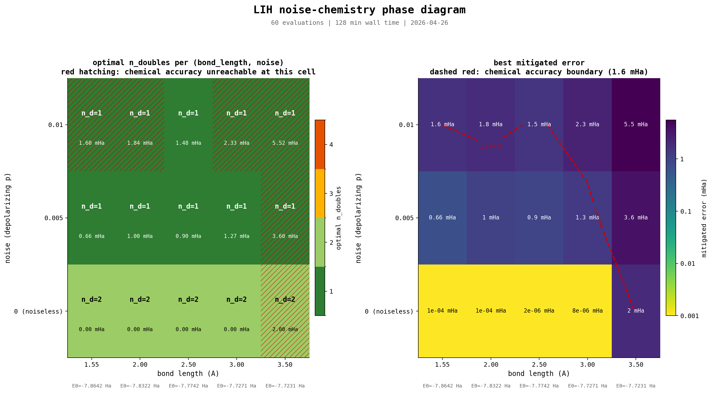

# LiH Noise-Chemistry Phase Diagram

## 1. Question

Two effects in the prior literature pull the optimal VQE circuit in opposite
directions. Stretching the bond increases electron correlation, so more
excitations help: at stretched LiH the singles became essential where they
were dispensable at equilibrium. Higher gate-level noise makes each
excitation expensive, so fewer excitations help: the v3 finding was that 2
doubles beat full UCCSD by 17x at p=0.01 for equilibrium LiH after ZNE.
Each effect was characterised independently. This experiment maps the joint
phase diagram in (bond_length, noise) and asks which effect wins where.

## 2. Method

LiH (6 qubits, 2 active electrons, 3 active orbitals, STO-3G), Jordan-Wigner
mapping, parametrised as a HF reference followed by SingleExcitation and
DoubleExcitation gates. Grid:

- bond_length in {1.546, 2.0, 2.5, 3.0, 3.5} Å (5 values)
- noise (depolarizing per gate) in {0.0, 0.005, 0.01} (3 values)
- n_doubles in {1, 2, 3, 4} (4 values)

Total 60 evaluations, 126.6 minutes wall time on CPU. Reduced from the
originally planned 6 x 4 x 4 = 96-cell grid after the pre-flight measured
127.9 s per cell, which extrapolated to over three hours for the full plan.
All four sanity-check geometries are preserved.

For each cell:

- All four singles are always included (matches the all_singles variant in
  validate_sweep.py).
- The top n_d doubles are taken from the gradient-magnitude ranking at the
  noiseless Hartree-Fock state.
- Mode A: parameters are optimised under noise on default.mixed, then
  evaluated three ways (ideal, raw noisy, ZNE-mitigated). The mitigated
  error is the reported metric.
- Hyperparameters are fixed across the grid: Nesterov, step=0.4, zero init,
  conv=1e-8, 5 minute time budget, ZNE scale_factors=[1, 2, 3], linear
  extrapolation.

Output: phase_data_lih.tsv (gitignored). Plots in
phase_diagram_*_lih.png. Reproduce with:

```
uv run phase_scan.py --molecule lih --bond-lengths 1.546 2.0 2.5 3.0 3.5 \
    --noise-levels 0.0 0.005 0.01 --n-doubles 1 2 3 4
uv run --extra analysis plot_phase_diagram.py --molecule lih
```

## 3. Results

### Phase diagram



Left panel: optimal n_doubles per cell, with red diagonal hatching where
the best mitigated error in that cell still exceeds chemical accuracy
(1.6 mHa). Right panel: best mitigated error per cell on a log10
viridis_r scale, with a dashed contour at the 1.6 mHa boundary.

### Optimal n_doubles and mitigated error

Cell value is "n_d, mitigated_error_mHa". Bold marks chemical accuracy.

| bond_length | p=0.000               | p=0.005          | p=0.010              |
| ----------- | --------------------- | ---------------- | -------------------- |
| 1.546 Å     | **n_d=2, 1.1e-4 mHa** | **n_d=1, 0.66**  | n_d=1, 1.60          |
| 2.0 Å       | **n_d=2, 1.2e-4 mHa** | **n_d=1, 1.00**  | n_d=1, 1.84          |
| 2.5 Å       | **n_d=2, 2.0e-6 mHa** | **n_d=1, 0.90**  | **n_d=1, 1.48 mHa**  |
| 3.0 Å       | **n_d=2, 8.0e-6 mHa** | **n_d=1, 1.27**  | n_d=1, 2.33          |
| 3.5 Å       | n_d=2, 2.00 mHa       | n_d=1, 3.60      | n_d=1, 5.52          |

Reported n_d at p=0 is the smallest count tied at the noiseless minimum;
n_d in {2, 3, 4} all converge to the same value within machine precision
at every bond length except 3.5 Å.

### Boundary observations

**The optimum is n_d=1 everywhere noisy.** With all four singles in the
circuit, the smallest non-trivial double count wins at every (bl, p) cell
where p > 0. No bond length at any tested noise level prefers n_d > 1.

**Chemical accuracy collapses to a single cell at p=0.01.** Noiseless
chemical accuracy holds for 4 of 5 bond lengths (all except 3.5 Å). At
p=0.005 the same 4 bond lengths still cross the threshold. At p=0.01,
only bl=2.5 Å reaches chemical accuracy (1.48 mHa). The useful zone shrinks
roughly tenfold per noise step.

**bl=2.5 Å is a noise-tolerance sweet spot.** It out-performs both
equilibrium (1.60 mHa) and bl=3.0 Å (2.33 mHa) at p=0.01. The dominant
double's gradient magnitude at the HF state grows with bond length:
0.024 at 1.546 Å, 0.033 at 2.5 Å, 0.061 at 3.0 Å, 0.108 at 3.5 Å. More
"energy per gate" lets the n_d=1 circuit absorb more noise before falling
out of chemical accuracy. The reason 3.0 and 3.5 Å do not benefit further
is the second effect below.

**bl=3.5 Å is an ansatz expressibility wall.** At p=0, n_d in {2, 3, 4} all
plateau at exactly 2.003 mHa rather than reaching machine precision. The
gradient ranking at this geometry reports |grad|=0 for two of the four
singles and two of the four doubles, so the optimiser leaves those four
parameters at zero. The remaining four-parameter ansatz cannot span the
FCI ground state at this geometry. Adding noise on top makes the error
grow but does not lift the floor.

**The boundary is piecewise.** The chemical-accuracy contour bends inward
at bl=2.5 (the only chem.acc. cell at p=0.01) and breaks completely at
bl=3.5 Å (no n_d reaches chemical accuracy at any noise level). The
smooth-looking line in the right panel is matplotlib's contour
interpolation on a 5x3 grid; the real boundary is discrete.

**Errors are strictly monotonic in noise.** All 20 (bl, n_d) pairs satisfy
err(p=0.0) < err(p=0.005) < err(p=0.01). No re-orderings, no instances of
ZNE recovering a noisy result back below the noiseless ideal.

## 4. Interpretation

The two effects do not balance in this configuration. Noise wins.

**Geometry-driven correlation never flips the optimum towards more doubles
at any tested noisy point.** Even at the most stretched geometry where the
ansatz still has expressibility (bl=3.0 Å), n_d=1 beats n_d=2, 3, 4 at both
p=0.005 and p=0.01. The expressibility gain from adding a second double is
real (it dominates the noiseless column) but smaller than the noise it
pays for under depolarizing channels.

**Noise-driven gate cost dominates everywhere with all_singles.** This run
is consistent with v3 in direction but shifted by one step. v3 (zero
singles) found n_d=2 optimal at p=0.01 for equilibrium LiH. Adding the
four singles, even though three of them have zero ideal gradient at every
geometry tested and one has near-zero gradient, raises the noise floor
enough that the optimum drops one further to n_d=1. The four singles
contribute four extra noisy gates per circuit and only marginal
expressibility, and the marginal noise from each additional double then
sits above the marginal expressibility threshold.

**The two effects momentarily balance only at bl=2.5 Å, p=0.01.** That cell
is the single point where the increasing-gradient-with-stretch effect
gives n_d=1 enough headroom to absorb p=0.01 noise and stay in chemical
accuracy. At equilibrium the gradient is too small; at 3.0 Å and beyond
the active-space exact energy has drifted too far from the HF starting
point and the n_d=1 ansatz cannot follow.

The shape of the phase diagram is therefore not a property of LiH alone.
It is a property of LiH plus the singles selection. With all_singles,
noise dominates and the useful zone is narrow. With zero_singles, v3
already showed a different balance at the equilibrium point; the joint
geometry-noise picture for that configuration has not been mapped here.

## 5. Practical implications

For LiH at this active space and basis, with all 4 singles always
included:

| If hardware noise is around    | Useful bond range (chem.acc.) | Optimal circuit    |
| ------------------------------ | ----------------------------- | ------------------ |
| p ≤ 0.001 (effectively noiseless) | 0.5 to 3.0 Å (3.5 Å fails on ansatz) | n_d=2, 4 singles |
| p = 0.005                      | 1.0 to 3.0 Å                  | n_d=1, 4 singles   |
| p = 0.01                       | ~2.5 Å only                   | n_d=1, 4 singles   |
| p > 0.01                       | none predicted by this grid   | n/a                |

A user running VQE on hardware in the p=0.01 regime should choose the
geometry to study, not just the molecule. The full LiH dissociation curve
is mostly out of reach at that noise level with this circuit and active
space, but the equilibrium-to-2.5 Å segment is reachable on a single
circuit shape (1 double, 4 singles, ZNE).

If the user can drop singles (zero_singles), v3 reported 0.13 mHa at
equilibrium with n_d=2 at p=0.01, suggesting a wider useful zone for the
zero_singles configuration. The corresponding map across geometries is
not in this run.

## 6. Limitations

- **Single molecule.** LiH only.
- **Single basis (STO-3G), small active space (3 orbitals, 2 electrons).**
  The bl=3.5 Å plateau at 2.00 mHa is partly an artefact of this active
  space; a larger active space could shift the right edge of the diagram.
- **Depolarizing noise only.** Real hardware has T1 and T2 decoherence,
  gate-specific error rates, crosstalk, and readout error. Different
  noise structure could change which excitations are most expensive and
  shift the optimum.
- **Linear ZNE with scale_factors=[1, 2, 3] only.** Polynomial or
  exponential extrapolation might recover more of the noisy circuits and
  push the chemical-accuracy boundary outward.
- **Reduced grid (5 x 3 x 4 = 60).** The compressed-bond regime
  (bl < 1.546 Å) and the intermediate noise level p=0.001 were dropped.
  The intermediate noise level likely contains the smoothest part of the
  boundary; adding it would clarify the transition shape.
- **Gradient ranking computed at the noiseless HF state only.** Per
  discovery_report.md the ranking is stable under depolarizing noise on
  LiH, so this is unlikely to shift the picture, but it has not been
  re-checked at every grid bond length.
- **All_singles only.** Zero_singles likely produces a different phase
  diagram with wider useful zones; that comparison is not in this run.
- **5 minute wall-clock optimisation budget per cell.** At the most
  stretched geometries and highest noise (bl=3.5 Å, p=0.005 and 0.01),
  the runs hit the budget rather than the convergence threshold. Results
  there are budget-limited and could improve with a longer budget.

## 7. Next experiments

- **Zero_singles phase diagram, same grid.** Likely recovers v3's wider
  chemical-accuracy band at p=0.01 and shifts the right edge of the
  useful zone outward to bl=3.0 Å or beyond.
- **H4 chain.** Strongly correlated, three-layer UCCSD needed at
  equilibrium. The geometry-driven correlation effect is real there, so
  the phase diagram boundary should be qualitatively different.
- **Realistic noise model.** IBM-style T1/T2 plus per-gate error rates
  could produce a different bl=2.5 Å sweet spot or move it.
- **ZNE variants.** Polynomial order=2 or exponential extrapolation.
  Likely recovers more of the noisier cells and lets n_d=2 stay
  competitive longer; predicts a shifted phase boundary.
- **Agentic mapping.** Can the agent map the same diagram with adaptive
  sampling (10 to 20 cells instead of 60)? The boundary-following
  structure of the diagram suggests yes.
- **Finer noise grid.** Add p=0.001, 0.002, 0.003 to nail down the
  curvature of the chemical-accuracy boundary between 0 and 0.005.
